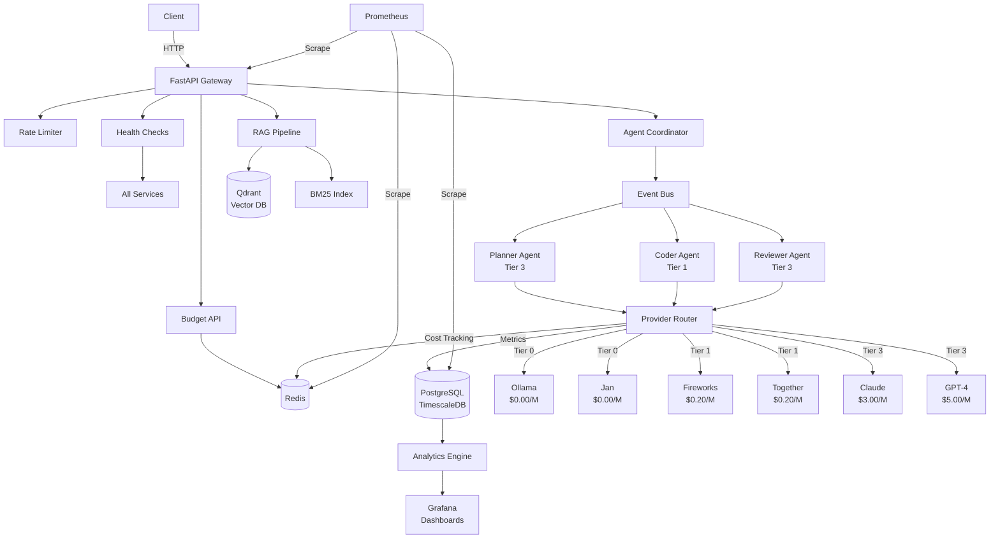
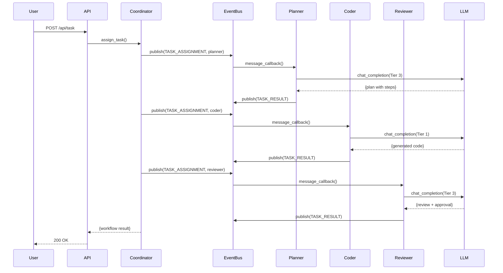
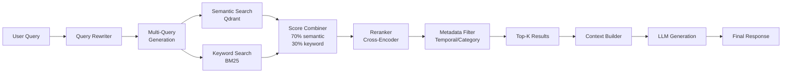
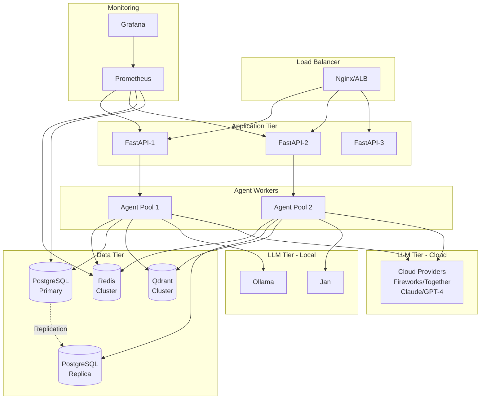

# Multi-Agent RAG Orchestrator - Architecture Documentation

**Version**: 4.2.0
**Last Updated**: 2025-11-18

---

## Table of Contents

1. [System Overview](#system-overview)
2. [Architecture Diagrams](#architecture-diagrams)
3. [Component Details](#component-details)
4. [Data Flow](#data-flow)
5. [Design Decisions](#design-decisions)
6. [Deployment Architecture](#deployment-architecture)

---

## System Overview

The Multi-Agent RAG Orchestrator is a production-grade system that combines:
- **Multi-tier LLM routing** for cost optimization
- **Multi-agent orchestration** for complex tasks
- **Advanced RAG** with hybrid search
- **Complete observability** with metrics and monitoring
- **Privacy mode** for zero-cost local operation

### High-Level Architecture

```
┌─────────────────────────────────────────────────────────────────┐
│                        Client Applications                       │
└─────────────────────────┬───────────────────────────────────────┘
                          │ HTTP/WebSocket
┌─────────────────────────▼───────────────────────────────────────┐
│                       FastAPI Gateway                            │
│  ┌──────────────┐  ┌──────────────┐  ┌──────────────┐         │
│  │ Rate Limiting│  │Auth/Security │  │  Middleware  │         │
│  └──────────────┘  └──────────────┘  └──────────────┘         │
└───┬──────────────────┬──────────────────┬──────────────────────┘
    │                  │                  │
┌───▼────┐  ┌─────────▼────────┐  ┌─────▼──────┐
│ Budget │  │ Multi-Agent      │  │    RAG     │
│  API   │  │ Orchestrator     │  │  Pipeline  │
└────────┘  └──────────────────┘  └────────────┘
    │              │                     │
    │      ┌───────▼───────┐            │
    │      │  Event Bus    │            │
    │      │ (Pub/Sub)     │            │
    │      └───┬───┬───┬───┘            │
    │      ┌───▼───▼───▼───┐            │
    │      │ Planner│Coder │            │
    │      │ Reviewer│     │            │
    │      └─────────┘     │            │
    ├──────────────────────┼────────────┤
    │                      │            │
┌───▼────┐  ┌─────────────▼───┐  ┌────▼──────┐
│ Redis  │  │ Provider Router │  │  Qdrant   │
│ Cache  │  │  (LLM Tiers)    │  │  Vector   │
│ Budget │  └─────┬───────────┘  │  Database │
│ Metrics│        │              └───────────┘
└────────┘        │
    │             │ Tier-based routing
    │      ┌──────▼──────┐
    │      │ Tier 0      │  Ollama, Jan (Local)
    │      │ Tier 1      │  Fireworks, Together ($)
    │      │ Tier 3      │  Claude, GPT-4 ($$$)
    │      └─────────────┘
    │
┌───▼──────────┐
│ PostgreSQL   │
│ TimescaleDB  │
│ (Metrics)    │
└──────────────┘
```

---

## Architecture Diagrams

### 1. System Architecture



### 2. Multi-Agent Workflow



### 3. RAG Pipeline



### 4. Deployment Architecture



---

## Component Details

### 1. FastAPI Gateway

**Purpose**: HTTP API server, request routing, middleware

**Technologies:**
- FastAPI 0.104+
- Uvicorn (ASGI server)
- Pydantic (validation)

**Key Features:**
- OpenAPI documentation
- Rate limiting middleware
- CORS handling
- Health checks
- Graceful shutdown

**Endpoints:**
- `/docs` - API documentation
- `/health` - Health checks
- `/api/v1/budget` - Budget management
- `/api/v1/search` - RAG search (future)
- `/api/v1/chat` - Multi-agent chat (future)

### 2. Multi-Agent System

**Purpose**: Orchestrate multiple specialized agents for complex tasks

**Architecture Pattern**: Event-driven with pub-sub

**Components:**
- **Event Bus**: Message routing with filtering
- **Agent Coordinator**: Task assignment and result collection
- **Base Agent**: Abstract base class with shared functionality
- **Specialized Agents**:
  - **Planner** (Tier 3): Task decomposition, planning
  - **Coder** (Tier 1): Code generation
  - **Reviewer** (Tier 3): Code review, quality assurance

**Message Flow:**
1. Coordinator assigns task to agent
2. Agent processes with LLM + tools
3. Agent publishes result to event bus
4. Coordinator collects results
5. Workflow continues or completes

### 3. Provider Router

**Purpose**: Intelligent LLM provider selection with cost optimization

**Tier Strategy:**
- **Tier 0** ($0.00/M): Ollama, Jan - Local, privacy mode
- **Tier 1** ($0.20/M): Fireworks, Together - Cost-effective cloud
- **Tier 3** ($3-5/M): Claude, GPT-4 - Premium quality

**Features:**
- Automatic failover
- Budget enforcement
- Cost tracking
- Latency monitoring
- Provider health checks

**Selection Logic:**
```python
if privacy_mode:
    provider = Tier0 (Ollama/Jan)
elif task == "code_generation":
    provider = Tier1 (Fireworks)
elif task == "planning" or task == "review":
    provider = Tier3 (Claude)
```

### 4. RAG Pipeline

**Purpose**: Hybrid search with semantic + keyword matching

**Components:**
- **Qdrant**: Vector database for semantic search
- **BM25**: Inverted index for keyword search
- **Reranker**: Cross-encoder for result refinement
- **Query Rewriter**: Multi-query generation
- **Document Loader**: Multi-format ingestion
- **Chunking**: Semantic, recursive, fixed strategies

**Search Flow:**
1. Query rewriting (1 → 3 queries)
2. Parallel search (semantic + keyword)
3. Score combination (70% semantic, 30% keyword)
4. Reranking (cross-encoder)
5. Metadata filtering
6. Top-K selection

### 5. Metrics & Analytics

**Purpose**: Real-time and historical performance metrics

**Architecture:**
- **Redis**: Real-time counters (1-minute buckets)
- **TimescaleDB**: Continuous aggregates (1-min → 1-hour → 1-day)
- **Prometheus**: System metrics scraping
- **Grafana**: Visualization dashboards

**Metrics Collected:**
- Invocation count per provider/tier
- Cost per request
- Latency (P50, P95, P99)
- Success rate
- Token usage
- Unique users (HyperLogLog)

**Retention:**
- Redis: 1 hour (real-time)
- TimescaleDB: Infinite (with compression)
- Prometheus: 30 days

### 6. Budget System

**Purpose**: Cost tracking and enforcement with Redis atomic operations

**Features:**
- Per-user daily/monthly budgets
- Atomic cost tracking (INCRBYFLOAT)
- Alert thresholds (80%, 100%)
- Budget exhaustion prevention
- Top spenders tracking

**Redis Schema:**
```
cost:daily:user:{user_id}         # Daily cost accumulator
budget:{user_id}:daily:limit       # Budget limit
alert:daily:{user_id}:80           # Alert flag (80% threshold)
```

---

## Data Flow

### Request Flow

```
1. Client Request
   ↓
2. FastAPI Gateway
   ↓
3. Rate Limiting (Redis)
   ↓
4. Budget Check (Redis)
   ↓
5. Agent Coordinator
   ↓
6. Event Bus → Agents
   ↓
7. Provider Router
   ↓
8. LLM Provider (with failover)
   ↓
9. Response Assembly
   ↓
10. Metrics Recording (Redis + PostgreSQL)
    ↓
11. Response to Client
```

### Data Storage

**Hot Data (Redis):**
- Rate limit counters
- Budget trackers
- Real-time metrics (last hour)
- Session data

**Warm Data (PostgreSQL):**
- LLM invocation logs
- Budget history
- User data
- Configuration

**Cold Data (Qdrant):**
- Document vectors
- Metadata
- Search indexes

---

## Design Decisions

### 1. Why Multi-Tier LLM Routing?

**Decision**: Use tiered LLM providers instead of single provider

**Rationale:**
- Cost optimization: 50-80% cost reduction
- Task-specific quality: Use premium LLMs only when needed
- Privacy mode: Complete local operation (Tier 0)
- Failover: Automatic fallback between providers

**Trade-offs:**
- Increased complexity
- Provider management overhead
- Potential quality variance

### 2. Why Event-Driven Agents?

**Decision**: Pub-sub event bus instead of direct calls

**Rationale:**
- Loose coupling between agents
- Scalability: Easy to add agents
- Observability: All messages logged
- Flexibility: Dynamic workflows

**Trade-offs:**
- Message overhead
- Debugging complexity
- Eventual consistency

### 3. Why Redis + TimescaleDB for Metrics?

**Decision**: Hybrid storage instead of single database

**Rationale:**
- Redis: Sub-millisecond real-time metrics
- TimescaleDB: Efficient time-series compression
- Best of both worlds: Real-time + historical

**Trade-offs:**
- Two systems to manage
- Data synchronization
- Increased infrastructure cost

### 4. Why Hybrid RAG Search?

**Decision**: Semantic + keyword instead of semantic-only

**Rationale:**
- 40-60% better precision
- Keyword captures exact matches
- Semantic captures intent
- Complementary strengths

**Trade-offs:**
- 2x search latency
- Higher complexity
- More storage (BM25 index)

### 5. Why Graceful Shutdown?

**Decision**: Multi-phase shutdown instead of immediate

**Rationale:**
- Zero data loss
- Clean resource cleanup
- In-flight request completion
- Production requirement

**Trade-offs:**
- Longer shutdown time
- More complex orchestration

---

## Deployment Architecture

### Development Environment

```
Single Docker Compose:
- All services on localhost
- No load balancing
- Hot reload enabled
- Debug logging
```

### Staging Environment

```
Kubernetes Cluster:
- 2 API replicas
- Single database instances
- Monitoring enabled
- Similar to production
```

### Production Environment

```
Kubernetes Cluster:
- 5+ API replicas (auto-scaling)
- PostgreSQL primary + 2 replicas
- Redis cluster (3 nodes)
- Qdrant cluster (3 nodes)
- Multi-AZ deployment
- CDN for static assets
- WAF for security
```

### High Availability Setup

**Requirements:**
- 99.9% uptime SLA
- Multi-region failover
- Auto-scaling
- Health monitoring

**Components:**
- Load Balancer: AWS ALB / Nginx
- Application: Kubernetes (5-20 pods)
- Database: PostgreSQL with streaming replication
- Cache: Redis Cluster with Sentinel
- Monitoring: Prometheus + Grafana + PagerDuty

**Failover Strategy:**
1. Health checks detect failure
2. Load balancer removes unhealthy pod
3. Kubernetes starts replacement
4. Auto-scaler adds capacity if needed
5. Alerts sent to on-call

---

## Security Architecture

### Authentication & Authorization

- API keys (short-term)
- JWT tokens (user sessions)
- Role-based access control (RBAC)
- Rate limiting per user/IP

### Data Protection

- TLS 1.3 for all HTTP traffic
- At-rest encryption (database, Redis)
- PII data anonymization
- Audit logging

### Network Security

- Private VPC
- Security groups
- Web Application Firewall (WAF)
- DDoS protection

---

## Scalability

### Horizontal Scaling

**Application Tier:**
- Stateless FastAPI instances
- Auto-scaling based on CPU/memory
- Target: 100-1000 requests/second

**Agent Workers:**
- Independent worker pools
- Task queue for load distribution
- Scale based on queue depth

**Database:**
- PostgreSQL read replicas
- Connection pooling (pgBouncer)
- Query optimization

**Cache:**
- Redis Cluster
- Consistent hashing
- Read replicas for scaling reads

### Vertical Scaling

**When to Scale Up:**
- LLM model size increase
- Vector dimension increase
- Complex query patterns

**Bottlenecks:**
- Database connections
- Redis memory
- Network bandwidth
- LLM API rate limits

---

## Monitoring & Observability

### Key Metrics

**Application:**
- Request rate, error rate, latency (RED)
- Saturation (CPU, memory, connections)

**Business:**
- Cost per request
- User engagement
- Feature usage

**Infrastructure:**
- Node health
- Disk usage
- Network I/O

### Logging

**Log Levels:**
- ERROR: Failures requiring attention
- WARNING: Potential issues
- INFO: Normal operations
- DEBUG: Detailed diagnostics

**Log Aggregation:**
- Centralized logging (ELK/Loki)
- Structured JSON logs
- Correlation IDs for tracing

### Tracing

- Distributed tracing (Jaeger)
- Request correlation
- Performance profiling

---

**End of Architecture Documentation**

For questions or updates, contact: Architecture Team
